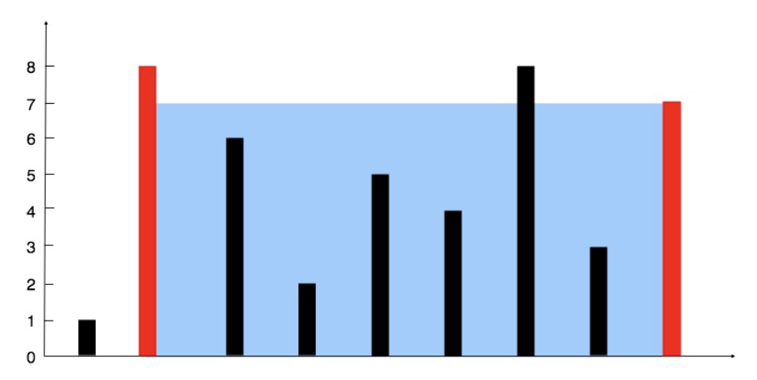

## 11. 盛最多水的容器


### 题目描述

给定 n 个非负整数 a1，a2，...，an，每个数代表坐标中的一个点 (i, ai) 。在坐标内画 n 条垂直线，垂直线 i 的两个端点分别为 (i, ai) 和 (i, 0)。找出其中的两条线，使得它们与 x 轴共同构成的容器可以容纳最多的水。

说明：你不能倾斜容器，且 n 的值至少为 2。


图中垂直线代表输入数组 [1,8,6,2,5,4,8,3,7]。在此情况下，容器能够容纳水（表示为蓝色部分）的最大值为 49。

​                     

```
示例:

输入: [1,8,6,2,5,4,8,3,7]
输出: 49
```


来源：力扣（LeetCode）
链接：https://leetcode-cn.com/problems/container-with-most-water

### 类型

双指针


### 题解

定义两个指针，计算两指针之间形成的面积；

若height[i] > height[j]：说明j的高度太小，又因为i，j要相互靠拢，所以j此时需要向左移动，去找一个比刚才更高的；

若height[i] < height[j]：同理，i++


### 代码

```python
class Solution:
    def maxArea(self, height: List[int]) -> int:
    	i, j, maxArea = 0, len(height) - 1, 0
    	while i < j:
    		area = min(height[i], height[j]) * (j - i)
    		if area > maxArea:
    			maxArea = area
    		if height[i] > height[j]:
    			j -= 1
    		else:
    			i += 1
    	return maxArea
```


### 结果

执行用时 :132 ms, 在所有 Python3 提交中击败了92.87%的用户

内存消耗 :14.7 MB, 在所有 Python3 提交中击败了60.61%的用户


### 反思

看到题解，别人用了反证法证明了两指针肯定会经过面积最大的情况。