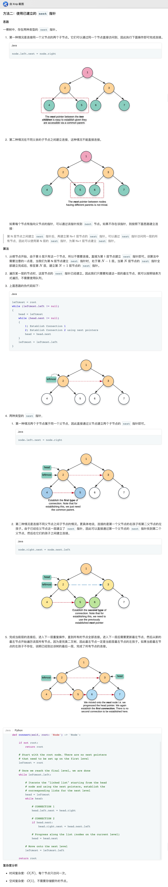

## 116. 填充每个节点的下一个右侧节点指针


### 题目描述

给定一个完美二叉树，其所有叶子节点都在同一层，每个父节点都有两个子节点。二叉树定义如下：

```
struct Node {
  int val;
  Node *left;
  Node *right;
  Node *next;
}
```


填充它的每个 next 指针，让这个指针指向其下一个右侧节点。如果找不到下一个右侧节点，则将 next 指针设置为 NULL。

初始状态下，所有 next 指针都被设置为 NULL。

来源：力扣（LeetCode）
链接：https://leetcode-cn.com/problems/populating-next-right-pointers-in-each-node

### 类型

二叉树、BFS


### 题解

当一层的时候，删除的节点的next为队列中的第一个节点


### 代码

```python
class Solution:
    def connect(self, root: 'Node') -> 'Node':
    	if root == None:
    		return None
    	que = []
    	length, count = 1, 0
    	que.append(root)
    	while len(que) != 0:
    		p = que.pop(0)
    		count += 1
    		if p.left != None:
    			que.append(p.left)
    		if p.right != None:
    			que.append(p.right)
    		if count == length:
    			length = len(que)
    			count = 0
    		else:
    			p.next = que[0]
    	return root
```


### 结果

执行用时 :164 ms, 在所有 Python3 提交中击败了5.18%的用户

内存消耗 :30.6 MB, 在所有 Python3 提交中击败了5.09%的用户


### 反思

空间复杂度上述为O(n)

