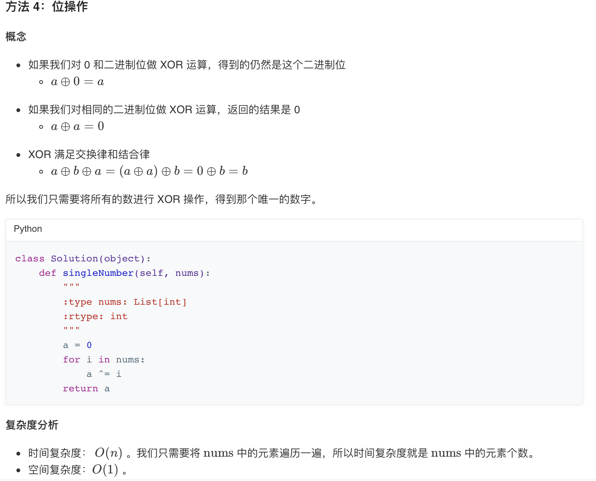

## 136. 只出现一次的数字


### 题目描述

给定一个非空整数数组，除了某个元素只出现一次以外，其余每个元素均出现两次。找出那个只出现了一次的元素。

说明：

你的算法应该具有线性时间复杂度。 你可以不使用额外空间来实现吗？

```
示例 1:

输入: [2,2,1]
输出: 1
示例 2:

输入: [4,1,2,1,2]
输出: 4
```

来源：力扣（LeetCode）
链接：https://leetcode-cn.com/problems/single-number

### 类型

哈希表、位操作


### 题解

未能实现不用额外空间；


### 代码

```python
class Solution:
    def singleNumber(self, nums: List[int]) -> int:
    	ans = {}
    	for i in range(len(nums)):
    		if ans.get(nums[i]) is None:
    			ans[nums[i]] = 1
    		else:
    			ans.pop(nums[i])
    	return ans.popitem()[0]
```


### 结果

执行用时 :104 ms, 在所有 Python3 提交中击败了56.77%的用户

内存消耗 :15.6 MB, 在所有 Python3 提交中击败了45.58%的用户


### 反思

