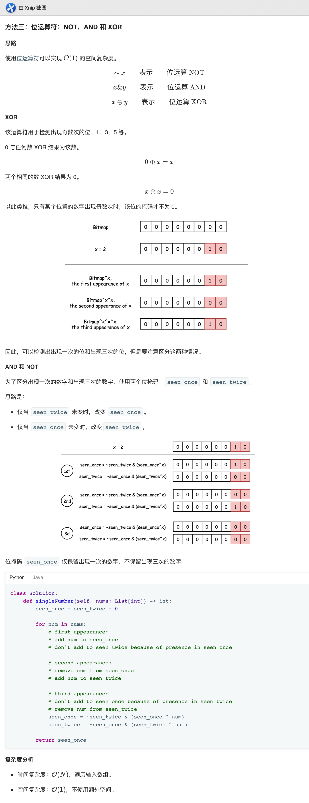

## 137. 只出现一次的数字


### 题目描述

给定一个非空整数数组，除了某个元素只出现一次以外，其余每个元素均出现了三次。找出那个只出现了一次的元素。

说明：

你的算法应该具有线性时间复杂度。 你可以不使用额外空间来实现吗？

```
示例 1:

输入: [2,2,3,2]
输出: 3
示例 2:

输入: [0,1,0,1,0,1,99]
输出: 99
```

来源：力扣（LeetCode）
链接：https://leetcode-cn.com/problems/single-number-ii

### 类型

位运算


### 题解



### 代码

```python
class Solution:
    def singleNumber(self, nums: List[int]) -> int:
        seen_once = seen_twice = 0
        
        for num in nums:
            seen_once = ~seen_twice & (seen_once ^ num)
            seen_twice = ~seen_once & (seen_twice ^ num)

        return seen_once
```


### 结果

执行用时 :28 ms, 在所有 Python3 提交中击败了99.88%的用户

内存消耗 :14.7 MB, 在所有 Python3 提交中击败了36.34%的用户