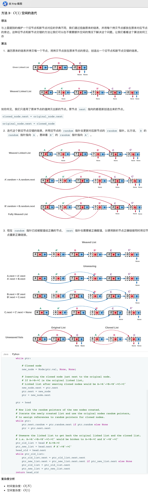

## 138. 复制带随机指针的链表


### 题目描述

给定一个链表，每个节点包含一个额外增加的随机指针，该指针可以指向链表中的任何节点或空节点。

要求返回这个链表的 深拷贝。 

我们用一个由 n 个节点组成的链表来表示输入/输出中的链表。每个节点用一个 [val, random_index] 表示：

val：一个表示 Node.val 的整数。
random_index：随机指针指向的节点索引（范围从 0 到 n-1）；如果不指向任何节点，则为  null 。


来源：力扣（LeetCode）
链接：https://leetcode-cn.com/problems/copy-list-with-random-pointer


### 类型

链表


### 题解

类似于133题，克隆图，不过这个稍微简单点；


### 代码

```python
class Solution:
    def copyRandomList(self, head: 'Node') -> 'Node':
    	if head == None:
    		return None
    	p = head
    	ans = {}
    	former = None
    	while p != None:
    		if ans.get(p) == None:
    			clone = Node(p.val, None, None)
    			ans[p] = clone
    		else:
    			clone = ans[p]
    		if p.random == None:
    			r_node = None
    		elif ans.get(p.random) == None:
    			r_node = Node(p.random.val, None, None)
    			ans[p.random] = r_node
    		else:
    			r_node = ans[p.random]
    		clone.random = r_node
    		if p == head:
    			former = clone
    		else:
    			former.next = clone
    			former = former.next
    		p = p.next
    	return ans[head]
```


### 结果

执行用时 :44 ms, 在所有 Python3 提交中击败了51.59%的用户

内存消耗 :14 MB, 在所有 Python3 提交中击败了72.47%的用户


### 反思

