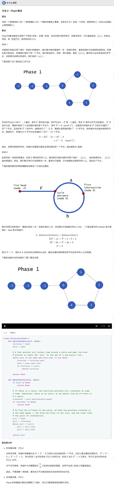

## 142. 环形链表II


### 题目描述

给定一个链表，返回链表开始入环的第一个节点。 如果链表无环，则返回 null。

为了表示给定链表中的环，我们使用整数 pos 来表示链表尾连接到链表中的位置（索引从 0 开始）。 如果 pos 是 -1，则在该链表中没有环。

说明：不允许修改给定的链表。

``` 
示例 1：

输入：head = [3,2,0,-4], pos = 1
输出：tail connects to node index 1
解释：链表中有一个环，其尾部连接到第二个节点。
```

来源：力扣（LeetCode）
链接：https://leetcode-cn.com/problems/linked-list-cycle-ii

### 类型

单链表


### 题解

想不到不用额外的空间


### 代码

```python
class Solution:
    def detectCycle(self, head: ListNode) -> ListNode:
    	if head == None:
    		return None
    	ans = {}
    	p, q = head, head.next
    	while q != None:
    		ans[p] = 1
    		if ans.get(q) != None:
    			return q
    		p = p.next
    		q = q.next
    	return None
```


### 结果

执行用时 :64 ms, 在所有 Python3 提交中击败了37.15%的用户

内存消耗 :16.5 MB, 在所有 Python3 提交中击败了34.47%的用户


### 反思

