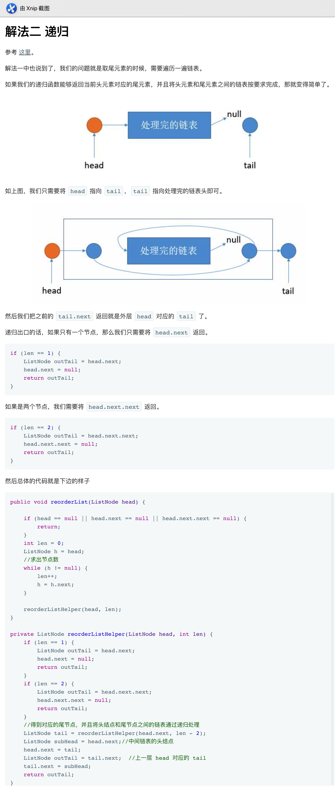

## 143. 重排链表


### 题目描述

给定一个单链表 L：L0→L1→…→Ln-1→Ln ，
将其重新排列后变为： L0→Ln→L1→Ln-1→L2→Ln-2→…

你不能只是单纯的改变节点内部的值，而是需要实际的进行节点交换。

```
示例 1:

给定链表 1->2->3->4, 重新排列为 1->4->2->3.
示例 2:

给定链表 1->2->3->4->5, 重新排列为 1->5->2->4->3.
```

来源：力扣（LeetCode）
链接：https://leetcode-cn.com/problems/reorder-list

### 类型

单链表


### 题解

- 通过快慢指针，找到中间的那个节点的前驱（需要让截断）
- 转置后半部分的链表
- 前后依次进行插入


### 代码

```python
class Solution:
    def reorderList(self, head: ListNode) -> None:
    	if head == None:
    		return 
    	p, q = head, head.next
    	while q != None and q.next != None:
    		p = p.next
    		q = q.next.next
    	latter = p.next
    	p.next = None
    	def reverse(head):
    		former = None
    		p = head
    		while p != None:
    			latter = p.next
    			p.next = former
    			former = p
    			p = latter
    		return former

    	reverse_latter = reverse(latter)
    	p = head
    	while reverse_latter != None:
    		q = p.next
    		r = reverse_latter.next
    		p.next = reverse_latter
    		reverse_latter.next = q
    		p = p.next.next
    		reverse_latter = r
```


### 结果

执行用时 :88 ms, 在所有 Python3 提交中击败了86.93%的用户

内存消耗 :22 MB, 在所有 Python3 提交中击败了35.30%的用户


### 反思

