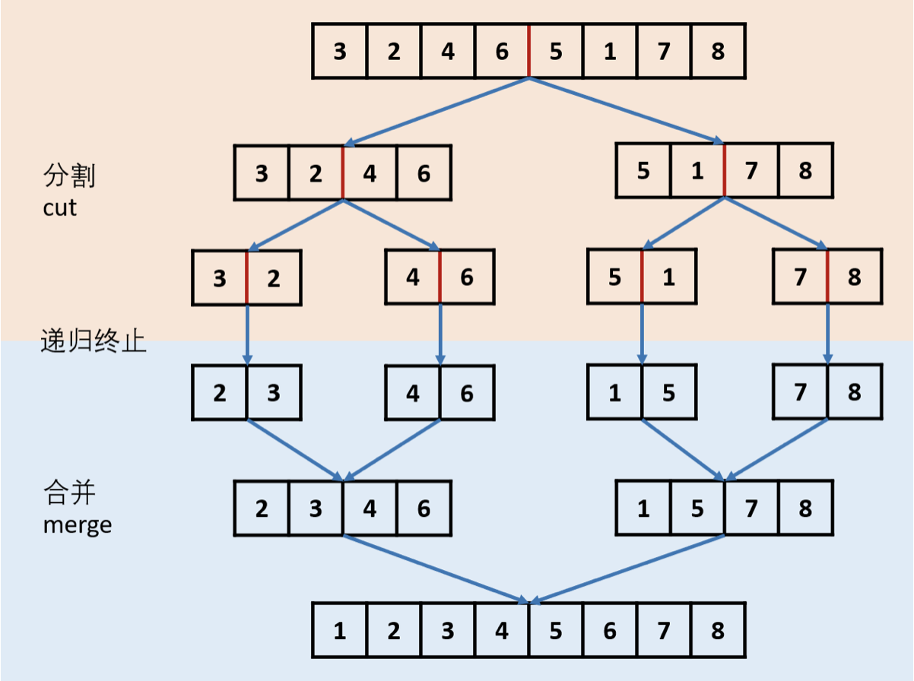

## 148. 排序链表


### 题目描述

在 O(n log n) 时间复杂度和常数级空间复杂度下，对链表进行排序。

```
示例 1:

输入: 4->2->1->3
输出: 1->2->3->4
示例 2:

输入: -1->5->3->4->0
输出: -1->0->3->4->5

```

来源：力扣（LeetCode）
链接：https://leetcode-cn.com/problems/sort-list

### 类型

单链表、归并排序


### 题解

一开始只想着快排，后来发现不对，快排怎么向前找，所以还有**归并**

归并类似于分治算法需要计算各个子模块，但与分治不同的是它还需要合起来。



### 代码

```python
class Solution:
    def sortList(self, head: ListNode) -> ListNode:
    	if head == None or head.next == None:
    		return head
    	low, fast = head, head.next
    	while fast!= None and fast.next != None:
    		low = low.next
    		fast = fast.next.next
    	p = low.next
    	low.next = None
    	l1 = self.sortList(head)
    	l2 = self.sortList(p)
    	l = ListNode(0)
    	q = l
    	while l1 != None and l2 != None:
    		if l1.val < l2.val:
    			q.next = l1
    			l1 = l1.next
    		else:
    			q.next = l2
    			l2 = l2.next
    		q = q.next
    	if l1 != None:
    		q.next = l1
    	if l2 != None:
    		q.next = l2
    	return l.next
```


### 结果

执行用时 :248 ms, 在所有 Python3 提交中击败了39.84%的用户

内存消耗 :20.3 MB, 在所有 Python3 提交中击败了37.31%的用户


### 反思

