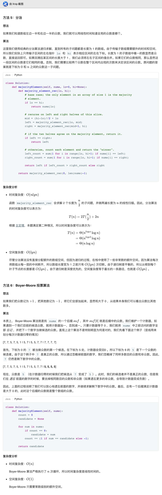

## 169. 多数元素


### 题目描述

给定一个大小为 n 的数组，找到其中的多数元素。多数元素是指在数组中出现次数大于 ⌊ n/2 ⌋ 的元素。

你可以假设数组是非空的，并且给定的数组总是存在多数元素。

```
示例 1:

输入: [3,2,3]
输出: 3
示例 2:

输入: [2,2,1,1,1,2,2]
输出: 2
```

来源：力扣（LeetCode）
链接：https://leetcode-cn.com/problems/majority-element

### 类型

分治、投票算法

### 题解

1、排序


### 代码

```python
class Solution:
    def majorityElement(self, nums: List[int]) -> int:
    	nums = sorted(nums)
    	return nums[len(nums) // 2]
```


### 结果

执行用时 :188 ms, 在所有 Python3 提交中击败了87.04%的用户

内存消耗 :14.4 MB, 在所有 Python3 提交中击败了44.96%的用户


### 反思

