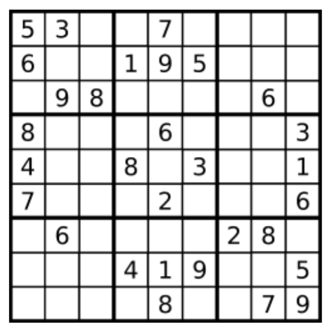

## 36. 有效的数独


### 题目描述

判断一个 9x9 的数独是否有效。只需要根据以下规则，验证已经填入的数字是否有效即可。

数字 1-9 在每一行只能出现一次。
数字 1-9 在每一列只能出现一次。
数字 1-9 在每一个以粗实线分隔的 3x3 宫内只能出现一次。



上图是一个部分填充的有效的数独。

数独部分空格内已填入了数字，空白格用 '.' 表示。

```
示例 1:

输入:
[
  ["5","3",".",".","7",".",".",".","."],
  ["6",".",".","1","9","5",".",".","."],
  [".","9","8",".",".",".",".","6","."],
  ["8",".",".",".","6",".",".",".","3"],
  ["4",".",".","8",".","3",".",".","1"],
  ["7",".",".",".","2",".",".",".","6"],
  [".","6",".",".",".",".","2","8","."],
  [".",".",".","4","1","9",".",".","5"],
  [".",".",".",".","8",".",".","7","9"]
]
输出: true
示例 2:

输入:
[
  ["8","3",".",".","7",".",".",".","."],
  ["6",".",".","1","9","5",".",".","."],
  [".","9","8",".",".",".",".","6","."],
  ["8",".",".",".","6",".",".",".","3"],
  ["4",".",".","8",".","3",".",".","1"],
  ["7",".",".",".","2",".",".",".","6"],
  [".","6",".",".",".",".","2","8","."],
  [".",".",".","4","1","9",".",".","5"],
  [".",".",".",".","8",".",".","7","9"]
]
输出: false
解释: 除了第一行的第一个数字从 5 改为 8 以外，空格内其他数字均与 示例1 相同。
但由于位于左上角的 3x3 宫内有两个 8 存在, 因此这个数独是无效的。
```


说明:

一个有效的数独（部分已被填充）不一定是可解的。
只需要根据以上规则，验证已经填入的数字是否有效即可。
给定数独序列只包含数字 1-9 和字符 '.' 。
给定数独永远是 9x9 形式的。

来源：力扣（LeetCode）
链接：https://leetcode-cn.com/problems/valid-sudoku

### 类型

哈希表


### 题解

想到是用**哈希表**来解决，将行、列、方块共27种情况均用哈希表进行映射；

遍历整个数组，(i，j)：

行：即为i；

列：9+j：

方块：18 + (i//3) * 3 + (j//3)

若哈希表不存在该键，则创建该键，并建立[0]*10的列表，且该列表的nums\[i\]\[j\]的索引的值为1；

若存在，则判断索引为nums\[i\]\[j\]的列表是为为1，为1则返回False；

循环跳出，返回True


### 代码

```python
class Solution:
    def isValidSudoku(self, board: List[List[str]]) -> bool:
    	ans = {}
    	for i in range(len(board)):
    		for j in range(len(board)):
    			if board[i][j].isdigit():
    				n = int(board[i][j])
    				if not self.isValid(n, i, ans):
    					return False
    				if not self.isValid(n, 9+j, ans):
    					return False
    				if not self.isValid(n, (i//3)*3+(j//3)+18, ans):
    					return False
    				
    	return True
    					
    def isValid(self, n: int, pos: int, ans):
    	if ans.get(pos) is None:
    		ans[pos] = [0] * 10
    		ans[pos][n] = 1
    	else:
    		if ans[pos][n] == 1:
    			return False
    		else:
    			ans[pos][n] = 1
    	return True
```


### 结果

执行用时 :108 ms, 在所有 Python3 提交中击败了76.38%的用户

内存消耗 :13.1 MB, 在所有 Python3 提交中击败了60.00%的用户


### 反思

看到题解，直接该位置的索引的值直接+1，最后判断是否都大于1即可（一个意思）。

且题解是：

```python
 # init data
        rows = [{} for i in range(9)]
        columns = [{} for i in range(9)]
        boxes = [{} for i in range(9)]
```

