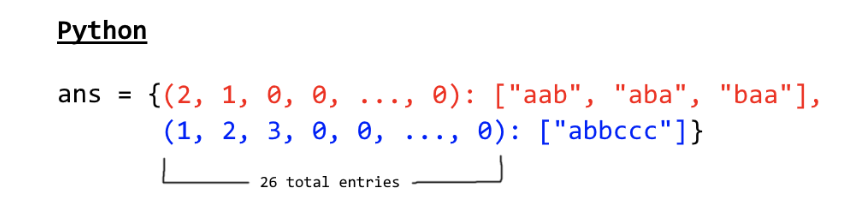

## 49. 字母异位词分组


### 题目描述

给定一个字符串数组，将字母异位词组合在一起。字母异位词指字母相同，但排列不同的字符串。

```
示例:

输入: ["eat", "tea", "tan", "ate", "nat", "bat"],
输出:
[
  ["ate","eat","tea"],
  ["nat","tan"],
  ["bat"]
]
```

说明：

所有输入均为小写字母。
不考虑答案输出的顺序。

来源：力扣（LeetCode）
链接：https://leetcode-cn.com/problems/group-anagrams

### 类型

字符串、哈希表


### 题解

遍历字符串，将当前字符串按ASCAII码进行排序，若哈希表不存在该键，则在哈希表中新增；若存在，则返回该键的值中添加当前字符串。


### 代码

```python
class Solution:
    def groupAnagrams(self, strs: List[str]) -> List[List[str]]:
    	hashmap = {}
    	for s in strs:
    		ss = ''.join(sorted(s))
    		if hashmap.get(ss) is None:
    			hashmap[ss] = [s]
    		else:
    			hashmap[ss].append(s)
    	return hashmap.values()
```


### 结果

执行用时 :108 ms, 在所有 Python3 提交中击败了85.77%的用户

内存消耗 :16.4 MB, 在所有 Python3 提交中击败了64.38%的用户


### 反思

官方题解使用了：`ans = collections.defaultdict(list)`

将键变成一个tuple()。

