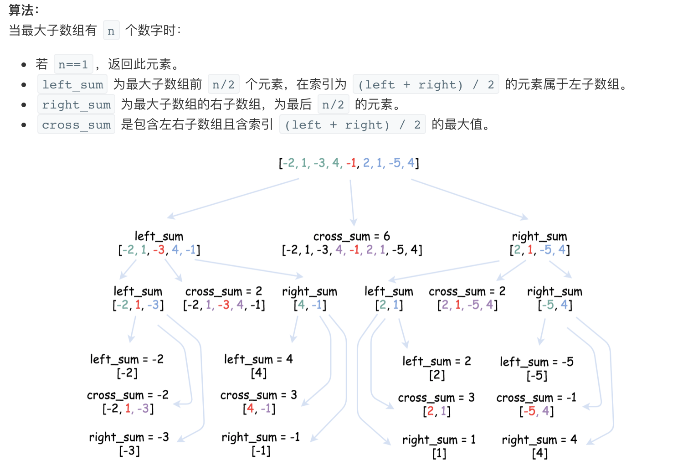
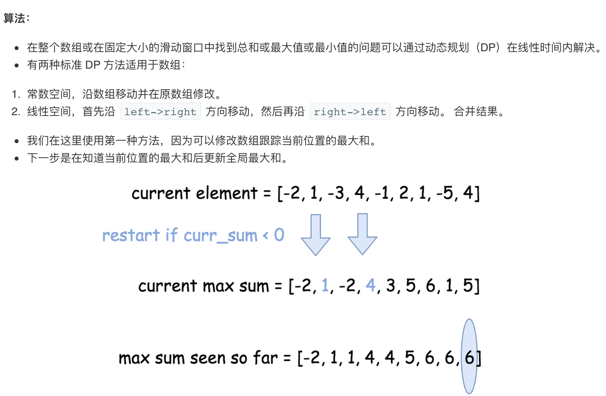

## 53. 最大子序和


### 题目描述

给定一个整数数组 nums ，找到一个具有最大和的连续子数组（子数组最少包含一个元素），返回其最大和。

```
示例:

输入: [-2,1,-3,4,-1,2,1,-5,4],
输出: 6
解释: 连续子数组 [4,-1,2,1] 的和最大，为 6。
```

进阶:

如果你已经实现复杂度为 O(n) 的解法，尝试使用更为精妙的分治法求解。

来源：力扣（LeetCode）
链接：https://leetcode-cn.com/problems/maximum-subarray


### 类型

分治算法、动态规划


### 题解

经典的最大子序和问题，以前算法课上讲过。可以采用分治算法的思想，和动态规划的思想。

**分治算法**：

最大子序和在分治算法中，可以由三部分决定：左边的最大子序和、右边的最大子序和、中间扩展的最大子序和。

左右两边，按照分治算法的思想递归进行；

**关于如何求中间扩展的最大子序和：**首先求出一直往左直至边界，最大的和为多少；再求出一直往右最大的和为多少；最后两者相加，即为中间扩展的最大子序和；

求出三者的最大值，即为该列表的最大子序和。



**动态规划：**


### 代码

分治：

```python
class Solution:
    def maxSubArray(self, nums: List[int]) -> int:
    	if len(nums) == 0:
    		return 0
    	return self.func(nums, 0, len(nums)-1)

    def func(self, nums: List[int], l: int, r: int) -> int:
    	if l == r:
    		return nums[l]
    	mid = (l + r) // 2
    	ll = self.func(nums, l, mid)
    	lr = self.func(nums, mid+1, r)
    	i, j, max_l, max_r, l_val, r_val = mid, mid + 1, nums[mid], 0, 0, 0
    	while i >= l:
    		l_val += nums[i]
    		if l_val > max_l:
    			max_l = l_val
    		i -= 1
    	while j <= r:
    		r_val += nums[j]
    		if r_val > max_r:
    			max_r = r_val
    		j += 1
    	results = max_l + max_r
    	return max(results, ll, lr)
```

动态规划：

```python
def maxSubArray(self, nums: List[int]) -> int:
  max_sum = nums[0]
  for i in range(1, len(nums)):
    if nums[i - 1] > 0:
      nums[i] += nums[i - 1]
      max_sum = max(max_sum, nums[i])
      return max_sum
```


### 结果

分治算法：

执行用时 :124 ms, 在所有 Python3 提交中击败了12.90%的用户

内存消耗 :13.6 MB, 在所有 Python3 提交中击败了69.49%的用户

动态规划：

执行用时 :76 ms, 在所有 Python3 提交中击败了79.25%的用户

内存消耗 :14.2 MB, 在所有 Python3 提交中击败了62.89%的用户


### 反思

分治算法不太熟，动态规划得需多考虑，多看；