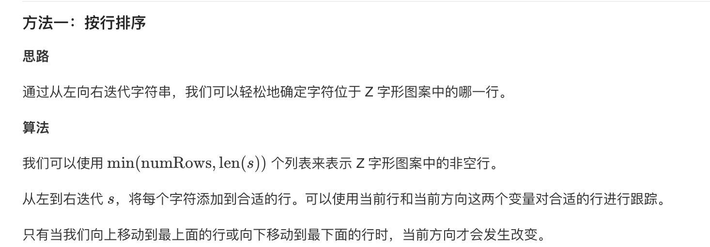

## 6. Z字形变换


### 题目描述

将一个给定字符串根据给定的行数，以从上往下、从左到右进行 Z 字形排列。

比如输入字符串为 "LEETCODEISHIRING" 行数为 3 时，排列如下：

L   C   I   R
E T O E S I I G
E   D   H   N
之后，你的输出需要从左往右逐行读取，产生出一个新的字符串，比如："LCIRETOESIIGEDHN"。

请你实现这个将字符串进行指定行数变换的函数：

string convert(string s, int numRows);

```
示例 1:

输入: s = "LEETCODEISHIRING", numRows = 3
输出: "LCIRETOESIIGEDHN"
示例 2:

输入: s = "LEETCODEISHIRING", numRows = 4
输出: "LDREOEIIECIHNTSG"
解释:

L     D     R
E   O E   I I
E C   I H   N
T     S     G
```

来源：力扣（LeetCode）
链接：https://leetcode-cn.com/problems/zigzag-conversion

### 类型

字符串


### 题解

首先绝对不能跟着题目走，去生成一个矩阵，然后按照对应是否存在字符去遍历，这样太过繁琐，我们决定去找规律；

假设r为当前所对应的行，j为字符在字符串中的索引，发现有以下规律：

- 第一行以及其它行在斜线上的字符与上一个字符相隔的索引为：`(num - r - 1) * 2`
- 最后一行以及其它行（除第一行）在直线上（除第一列）上的字符与上一个字符相隔的索引为：`r * 2`

由此我们可以交替两个规律得到对应的字符串，**所以需要一个flag标签进行交替**；

**需要单独判断numRows=1的情况，不然会死循环**


### 代码

```python
class Solution:
    def convert(self, s: str, numRows: int) -> str:
    	if numRows == 1:
    		return s
    	conv = ""
    	for r in range(numRows):
    		j, flag = r, 1
    		while j < len(s):
    			conv += s[j]
    			if (flag > 0 or r == 0) and r != numRows - 1 :
    				j += (numRows - r - 1) * 2
    			elif flag < 0 or r == numRows - 1:
    				j += r * 2
    			flag = - flag
    	return conv
```


### 结果

执行用时 :68 ms, 在所有 Python3 提交中击败了58.12%的用户

内存消耗 :13 MB, 在所有 Python3 提交中击败了63.57%的用户


### 反思

官方给出的题解中的方法一真是太巧妙了！

