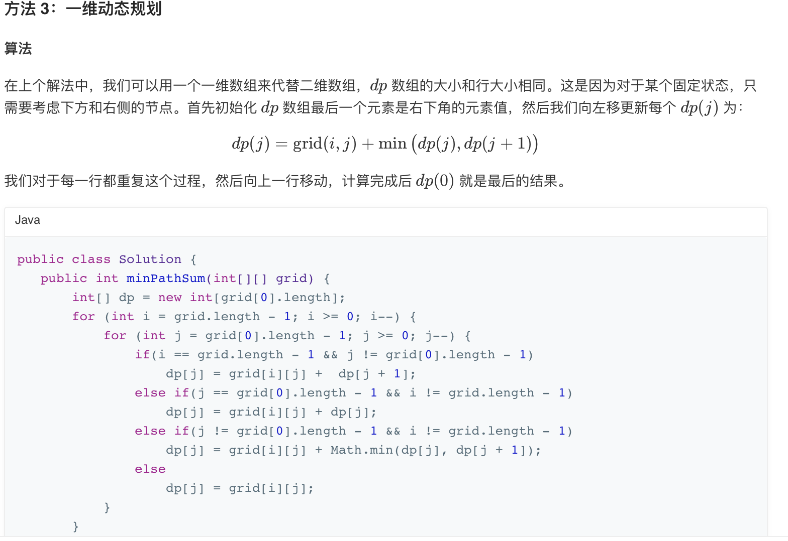

## 64. 最小路径和


### 题目描述

给定一个包含非负整数的 m x n 网格，请找出一条从左上角到右下角的路径，使得路径上的数字总和为最小。

说明：每次只能向下或者向右移动一步。

```
示例:

输入:
[
  [1,3,1],
  [1,5,1],
  [4,2,1]
]
输出: 7
解释: 因为路径 1→3→1→1→1 的总和最小。
```

来源：力扣（LeetCode）
链接：https://leetcode-cn.com/problems/minimum-path-sum

### 类型

动态规划


### 题解

**到达当前位置的最小路径，为左、上两个的最小路径中的最小值+当前值**


### 代码

```python
class Solution:
    def minPathSum(self, grid: List[List[int]]) -> int:
    	m, n = len(grid), len(grid[0])
    	min_len = [[0] * n for _ in range(m)]
    	for i in range(m):
    		for j in range(n):
    			if i == 0 and j == 0:
    				min_len[i][j] = grid[i][j]
    			elif i == 0:
    				min_len[i][j] = min_len[i][j-1] + grid[i][j]
    			elif j == 0:
    				min_len[i][j] = min_len[i-1][j] + grid[i][j]
    			else:
    				min_len[i][j] = min(min_len[i-1][j], min_len[i][j-1]) + grid[i][j]
    	return min_len[m-1][n-1]
```


### 结果

执行用时 :116 ms, 在所有 Python3 提交中击败了61.58%的用户

内存消耗 :14.7 MB, 在所有 Python3 提交中击败了53.17%的用户


### 反思

官方题解用了1维数组进行存储；

