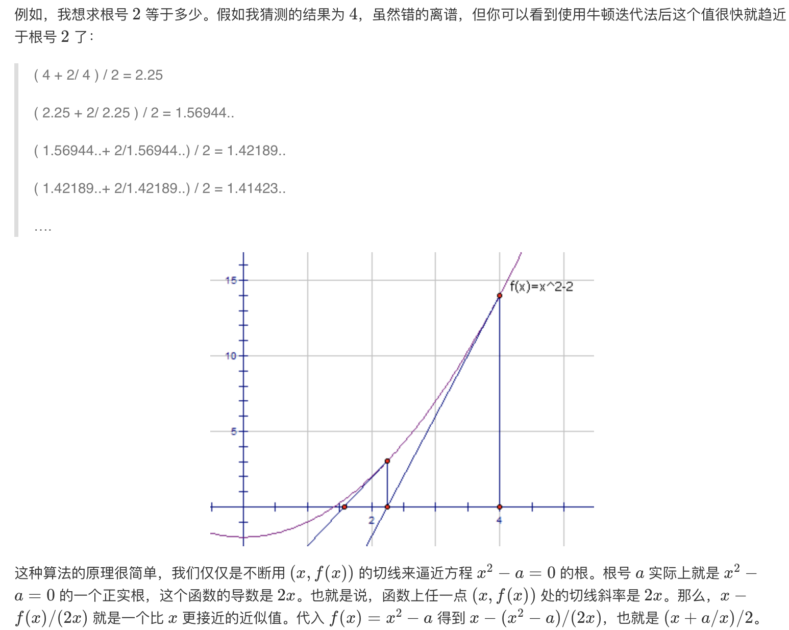

## 69. x的平方根


### 题目描述

实现 int sqrt(int x) 函数。

计算并返回 x 的平方根，其中 x 是非负整数。

由于返回类型是整数，结果只保留整数的部分，小数部分将被舍去。

```
示例 1:

输入: 4
输出: 2
示例 2:

输入: 8
输出: 2
说明: 8 的平方根是 2.82842..., 
     由于返回类型是整数，小数部分将被舍去。
```

来源：力扣（LeetCode）
链接：https://leetcode-cn.com/problems/sqrtx


### 类型

二分查找


### 题解

一开始去百度了手算的开平方法，未得其解；然后循环遍历，超时；最后，采用了二分查找，才勉强通过；


### 代码

```python
class Solution:
    def mySqrt(self, x: int) -> int:
    	if x == 0:
    		return 0
    	return self.binarySearch(x, 1, x // 2 + 1)

    def binarySearch(self, x: int, l: int, r: int) -> int:
    	mid = (l + r) // 2
    	if mid ** 2 <= x and (mid + 1) ** 2 > x:
    		return mid
    	elif mid ** 2 > x:
    		return self.binarySearch(x, l, mid)
    	elif mid ** 2 < x and (mid + 1) ** 2 <= x:
    		return self.binarySearch(x, mid + 1, r)
```


### 结果

执行用时 :48 ms, 在所有 Python3 提交中击败了53.01%的用户

内存消耗 :13.1 MB, 在所有 Python3 提交中击败了63.48%的用户


### 反思

看到题解降到牛顿法，**数值分析**的知识早就忘光了。。。



```python
class Solution:

    def mySqrt(self, x):
        if x < 0:
            raise Exception('不能输入负数')
        if x == 0:
            return 0
        cur = 1
        while True:
            pre = cur
            cur = (cur + x / cur) / 2
            if abs(cur - pre) < 1e-6:
                return int(cur)
```

