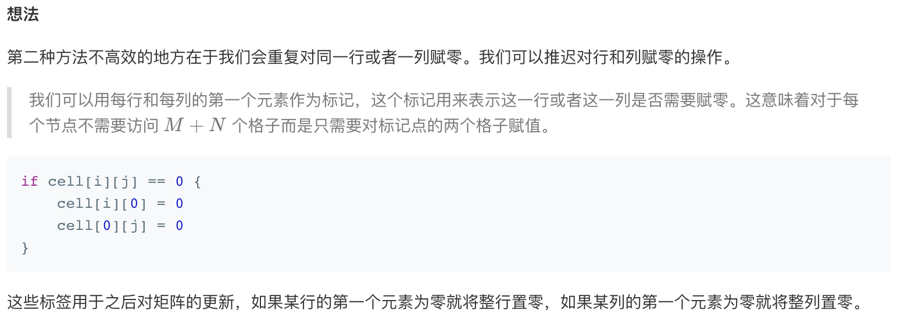

## 73. 矩阵置零


### 题目描述

给定一个 m x n 的矩阵，如果一个元素为 0，则将其所在行和列的所有元素都设为 0。请使用原地算法。

```
示例 1:

输入: 
[
  [1,1,1],
  [1,0,1],
  [1,1,1]
]
输出: 
[
  [1,0,1],
  [0,0,0],
  [1,0,1]
]
示例 2:

输入: 
[
  [0,1,2,0],
  [3,4,5,2],
  [1,3,1,5]
]
输出: 
[
  [0,0,0,0],
  [0,4,5,0],
  [0,3,1,0]
]
```

进阶:

一个直接的解决方案是使用  O(mn) 的额外空间，但这并不是一个好的解决方案。
一个简单的改进方案是使用 O(m + n) 的额外空间，但这仍然不是最好的解决方案。
你能想出一个常数空间的解决方案吗？

来源：力扣（LeetCode）
链接：https://leetcode-cn.com/problems/set-matrix-zeroes

### 类型

数组

### 题解

空间复杂度为O(m+n)，未想到常数空间


### 代码

```python
class Solution:
    def setZeroes(self, matrix: List[List[int]]) -> None:
    	r, c = [0]*len(matrix), [0]*len(matrix[0])
    	for i in range(len(matrix)):
    		for j in range(len(matrix[0])):
    			if matrix[i][j] == 0:
    				r[i] = 1
    				c[j] = 1
    	for i in range(len(matrix)):
    		if r[i] == 1:
    				matrix[i] = [0] * len(matrix[0])
    		for j in range(len(matrix[0])):
    			if c[j] == 1:
    				matrix[i][j] = 0
```


### 结果

执行用时 :136 ms, 在所有 Python3 提交中击败了92.29%的用户

内存消耗 :13.7 MB, 在所有 Python3 提交中击败了55.95%的用户


### 反思

直接在原矩阵作标记

