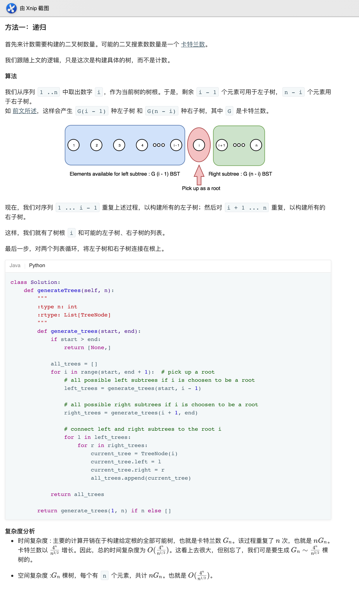

## 95. 不同的二叉线索树II


### 题目描述

给定一个整数 n，生成所有由 1 ... n 为节点所组成的二叉搜索树。

```
示例:

输入: 3
输出:
[
  [1,null,3,2],
  [3,2,null,1],
  [3,1,null,null,2],
  [2,1,3],
  [1,null,2,null,3]
]
解释:
以上的输出对应以下 5 种不同结构的二叉搜索树：

   1         3     3      2      1
    \       /     /      / \      \
     3     2     1      1   3      2
    /     /       \                 \
   2     1         2                 3
```

来源：力扣（LeetCode）
链接：https://leetcode-cn.com/problems/unique-binary-search-trees-ii

### 类型

二叉搜索树


### 题解

又是没做出的一道题



### 代码

```python
class Solution:
    def generateTrees(self, n: int) -> List[TreeNode]:
        def generate_trees(start, end):
            if start > end:
                return [None,]
           
            all_trees = []
            for i in range(start, end + 1):  
                left_trees = generate_trees(start, i - 1)
                right_trees = generate_trees(i + 1, end)
                for l in left_trees:
                    for r in right_trees:
                        current_tree = TreeNode(i)
                        current_tree.left = l
                        current_tree.right = r
                        all_trees.append(current_tree) 
            return all_trees
        return generate_trees(1, n) if n else []
```


### 结果

### 结果

执行用时 :60 ms, 在所有 Python3 提交中击败了57.37%的用户

内存消耗 :14.7 MB, 在所有 Python3 提交中击败了50.78%的用户


### 反思

