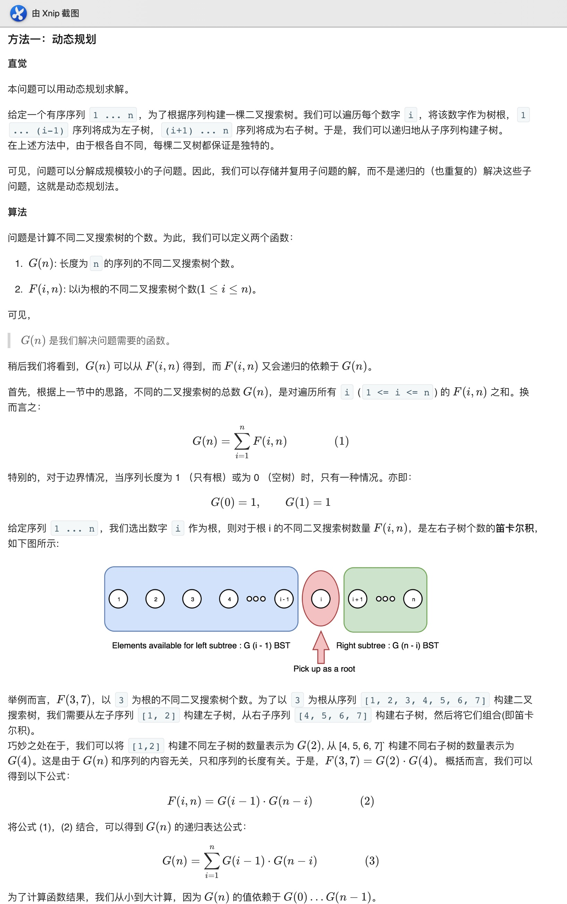

## 96. 不同的二叉搜索树


### 题目描述

给定一个整数 n，求以 1 ... n 为节点组成的二叉搜索树有多少种？

```
示例:

输入: 3
输出: 5
解释:
给定 n = 3, 一共有 5 种不同结构的二叉搜索树:

   1         3     3      2      1
    \       /     /      / \      \
     3     2     1      1   3      2
    /     /       \                 \
   2     1         2                 3
```

来源：力扣（LeetCode）
链接：https://leetcode-cn.com/problems/unique-binary-search-trees

### 类型

动态规划


### 题解

没做出来，没想明白，看官方题解




### 代码

```python
class Solution:
    def numTrees(self, n):
        G = [0]*(n+1)
        G[0], G[1] = 1, 1
        for i in range(2, n+1):
            for j in range(1, i+1):
                G[i] += G[j-1] * G[i-j]
        return G[n]

    def numTrees(self, n: int) -> int:
    	C = 1
    	for i in range(n):
    		C = C * 2 * (2 * i + 1) / (i+2)
    	return int(C)
```


### 结果

执行用时 :40 ms, 在所有 Python3 提交中击败了33.75%的用户

内存消耗 :12.9 MB, 在所有 Python3 提交中击败了49.35%的用户


### 反思

