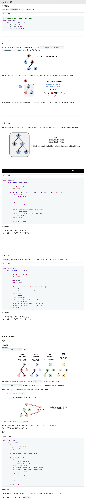

## 98. 验证二叉搜索树


### 题目描述

给定一个二叉树，判断其是否是一个有效的二叉搜索树。

假设一个二叉搜索树具有如下特征：

节点的左子树只包含小于当前节点的数。
节点的右子树只包含大于当前节点的数。
所有左子树和右子树自身必须也是二叉搜索树。

```
示例 1:

输入:
    2
   / \
  1   3
输出: true
示例 2:

输入:
    5
   / \
  1   4
     / \
    3   6
输出: false
解释: 输入为: [5,1,4,null,null,3,6]。
     根节点的值为 5 ，但是其右子节点值为 4 。
```

来源：力扣（LeetCode）
链接：https://leetcode-cn.com/problems/validate-binary-search-tree

### 类型

DFS, 二叉树


### 题解

想了这么久，Debug这么多次，跟没做出来没什么区别；

通过深度优先遍历去寻找。

有以下几种情况：

```
\                            /                   /                \
 \													/                   /                  \
  \												 /                   /                    \
   \									  	/                   /                      \
    \											\                  /                        \
    /                      \
   /                        \
  /                          \
 /                            \
```

当出现拐点的时候，例如第一种情况，出现了**当前节点p.left不仅要小于p并且必须要大于p的前驱节点**，第二种类似；第三种情况则是一直没出现过拐点，只需要**p.left小于p即可**

**所以如何判断是否出现了拐点？**，只需要记录p节点的前驱节点，当要判断p.left时，若q（p的前驱）不为None，并且q.right等于p，**则说明上一部是向右边走，这次往左边，则说明出现了拐点！**，此时就需要用一个节点r保存此时的q，为拐点的前驱节点；


故进行判断时，以左子树为例：

当p.left值大于p的值 或者 **存在拐点（即r！=None）并且p.left的值小于拐点的值，则不是线索二叉树**


**当然在判断右子树的时候，之前左子树可能对拐点产生变化，所以一开始需要一个节点s去保存之前的拐点，到右子树时，r==s**


### 代码

```python
class Solution:
	def __init__(self):
		self.flag = True

	def isValidBST(self, root: TreeNode) -> bool:
		if root == None:
			return True
		self.dfs(root, None, None)
		return self.flag
    	
	def dfs(self, p: TreeNode, q: TreeNode, r: TreeNode):
		if self.flag == False:
			return
		s = r
		if p.left != None:
			if q != None and q.right == p:
					r = q
			if p.left.val >= p.val or (r != None and p.left.val <= r.val):
				self.flag = False
			else:
				self.dfs(p.left, p, r)
		r = s
		if p.right != None:
			if q!= None and q.left == p:
					r = q
			if p.right.val <= p.val or (r!= None and p.right.val >= r.val):
				self.flag = False
			else:
				self.dfs(p.right, p, r)
```


### 结果

执行用时 :52 ms, 在所有 Python3 提交中击败了62.21%的用户

内存消耗 :15.5 MB, 在所有 Python3 提交中击败了58.97%的用户


### 反思

为什么想那么复杂，直接保存当前的上界下界不就可以么！！！

